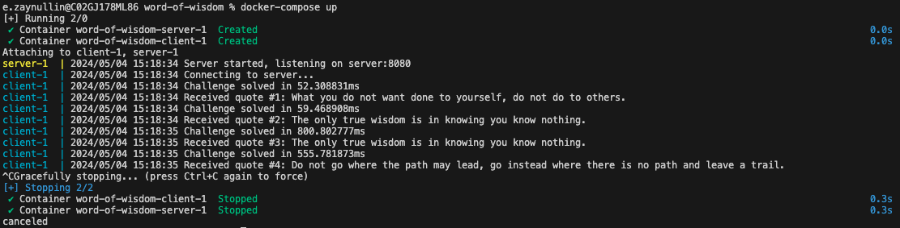

[](https://github.com/ed16/word-of-wisdom/actions/workflows/ci-cd.yml)
[](https://coveralls.io/github/ed16/word-of-wisdom)
# word-of-wisdom
There is simple "Word of Wisdom" TCP server implemented using Go.

The server use a Proof of Work (PoW) algorithm to mitigate the risk of DDoS attacks.  
Dockerfiles are provided both the server and a client that can solve the PoW challenge.

## 1. Choice of PoW Algorithm
The Hashcash PoW algorithm is chosen for its simplicity and widespread use, notably in systems like Bitcoin for email spam mitigation. This algorithm requires the requester to compute the hash of some data where the hash starts with a certain number of zero bits. The difficulty can be adjusted by changing the number of leading zeros required.

## 2. Server Implementation
The server:

Listen for incoming TCP connections.
Issue a PoW challenge to the client.
Validate the client's response.
If the response is valid, send a random quote from a predefined list.

## 3. Client Implementation
The client:

Connect to the server.
Receive the PoW challenge.
Compute the valid hash.
Send the hash back to the server to gain access to the service.
Receive and display the quote.

## 4. Getting started

```
# Run server and client by docker-compose
docker-compose up
```


## 5. Next steps

Definitely, there are a lot of things to be improved in the project, like:

1. Increase test coverage, add more comprehensive unit tests with all negative scenarios and edge cases
2. Add performance tests
3. Change message format to binary in order to optimize the network communication
4. Add comprehensive logging
5. etc.
